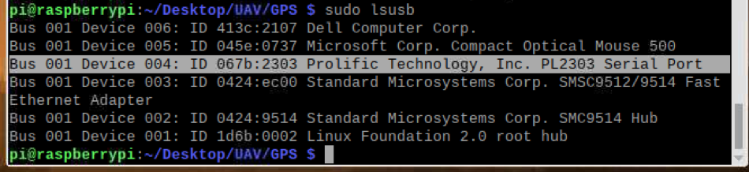
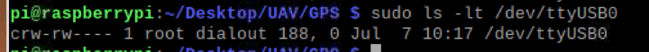
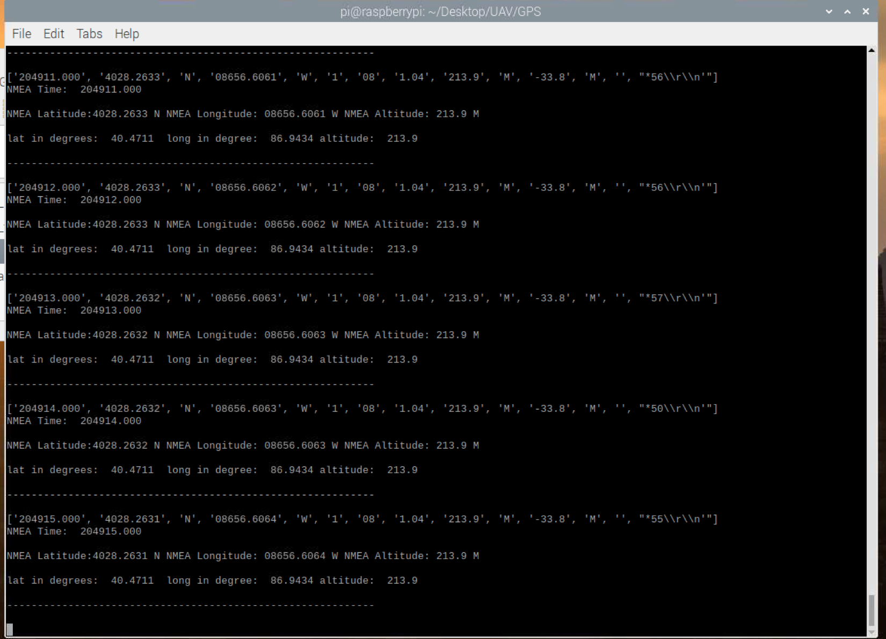

# GPS sensor setting
environment setting
```
ls /dev/ttyUSB*

sudo lsusb

sudo cat /dev/ttyUSB0

sudo apt-get install gpsd gpsd-clients


```
```
sudo systemctl enable gpsd.socket
sudo systemctl start gpsd.socket
sudo gpsd /dev/ttyUSB0 -F /var/run/gpsd.sock

```


~~cgps -s~~


```
sudo killall gpsd
sudo gpsd /dev/ttyUSB0 -F /var/run/gpsd.sock

```

```
cd /home/pi/Desktop/UAV/GPS
python3 gps_testSerial.py

```

<p align="center">
    </a>
</p>
<p align="center">
    </a>
</p>
<p align="center">
    </a>
</p>