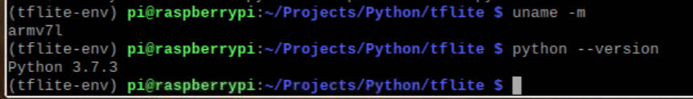

#Steps of deploying Tf_lite_SSD


```
cd ~
nano .bashrc
alias python=python3
alias pip=pip3
source .bashrc
mkdir -p Projects/Python/tflite
cd Projects/Python/tflite
python -m pip install virtualenv
python -m venv tflite-env
```

Upgrading pip
```
python -m pip install -U pip
```

activate the virtual env
```
source tflite-env/bin/activate


```
opencv
```
sudo apt -y install libjpeg-dev libtiff5-dev libjasper-dev libpng12-dev libavcodec-dev libavformat-dev libswscale-dev libv4l-dev libxvidcore-dev libx264-dev
sudo apt -y install qt4-dev-tools libatlas-base-dev libhdf5-103 
python -m pip install opencv-contrib-python==4.1.0.25
```
```
uname -m
python --version

```
- “armv7l” is a 32-bit ARM processor
- python 3.7.3
<p align="center">
    </a>
</p>

Build TensorFlow Lite for ARM boards
- https://www.tensorflow.org/lite/guide/build_arm
```
<del>python -m pip install </del>
```
