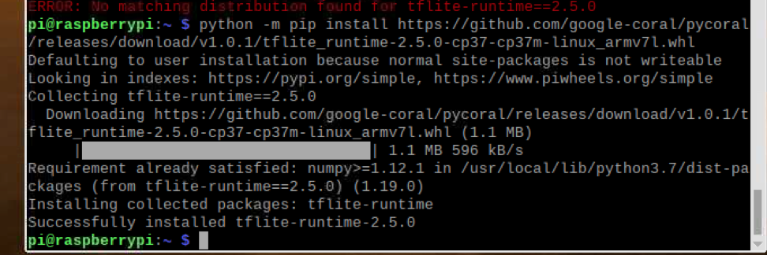
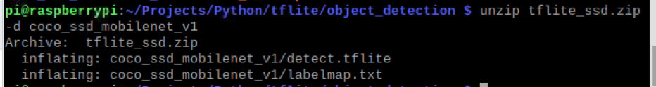

#Steps of deploying Tf_lite_SSD


```
cd ~
nano .bashrc
alias python=python3
alias pip=pip3
source .bashrc
mkdir -p Projects/Python/tflite
cd Projects/Python/tflite
python -m pip install virtualenv

```

Upgrading pip
```
python -m pip install -U pip
```

activate the virtual env
```
python -m venv tflite-env
source tflite-env/bin/activate


```
opencv
```
sudo apt -y install libjpeg-dev libtiff5-dev libjasper-dev libpng12-dev libavcodec-dev libavformat-dev libswscale-dev libv4l-dev libxvidcore-dev libx264-dev
sudo apt -y install qt4-dev-tools libatlas-base-dev libhdf5-103 
python -m pip install opencv-contrib-python==4.1.0.25
```
```
uname -m
python --version

```
- “armv7l” is a 32-bit ARM processor
- python 3.7.3
<p align="center">
    </a>
</p>

Build TensorFlow Lite with CMake
- https://www.tensorflow.org/lite/guide/build_cmake
Build TensorFlow Lite for ARM boards
- https://www.tensorflow.org/lite/guide/build_arm

<!-- <del>python -m pip install https://github.com/google-coral/pycoral/releases/download/v1.0.1/pycoral-1.0.1-cp37-cp37m-linux_armv7l.whl</del>
 -->
```
sudo apt-get update
sudo apt-get install cmake

git clone https://github.com/tensorflow/tensorflow.git tensorflow_src

mkdir tflite_build
cd tflite_build
cmake ../tensorflow_src/tensorflow/lite
<del>cmake ../tensorflow_src/tensorflow/lite -DCMAKE_BUILD_TYPE=Debug</del>
cmake --build . -j
```
Install TensorFlow Lite for Python
- https://www.tensorflow.org/lite/guide/python
- Debian package repo
```
echo "deb https://packages.cloud.google.com/apt coral-edgetpu-stable main" | sudo tee /etc/apt/sources.list.d/coral-edgetpu.list
curl https://packages.cloud.google.com/apt/doc/apt-key.gpg | sudo apt-key add -
sudo apt-get update
sudo apt-get install python3-tflite-runtime
```
select one from all tflite_runtime wheels.
- https://github.com/google-coral/pycoral/releases/
<p align="center">
    </a>
</p>
```
python -m pip install https://github.com/google-coral/pycoral/releases/download/v1.0.1/tflite_runtime-2.5.0-cp37-cp37m-linux_armv7l.whl

wget https://tfhub.dev/tensorflow/lite-model/ssd_mobilenet_v1/1/metadata/1?lite-format=tflite
wget https://storage.googleapis.com/download.tensorflow.org/models/tflite/coco_ssd_mobilenet_v1_1.0_quant_2018_06_29.zip -O tflite_ssd.zip
mkdir -p ~/Projects/Python/tflite/object_detection/coco_ssd_mobilenet_v1
cd ~/Projects/Python/tflite/object_detection
mv ~/tflite_ssd.zip .
ls
unzip tflite_ssd.zip -d coco_ssd_mobilenet_v1
```
<p align="center">
    </a>
</p>
